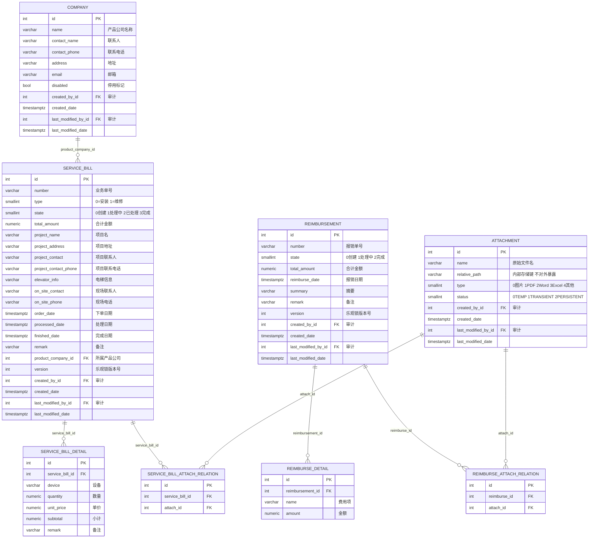
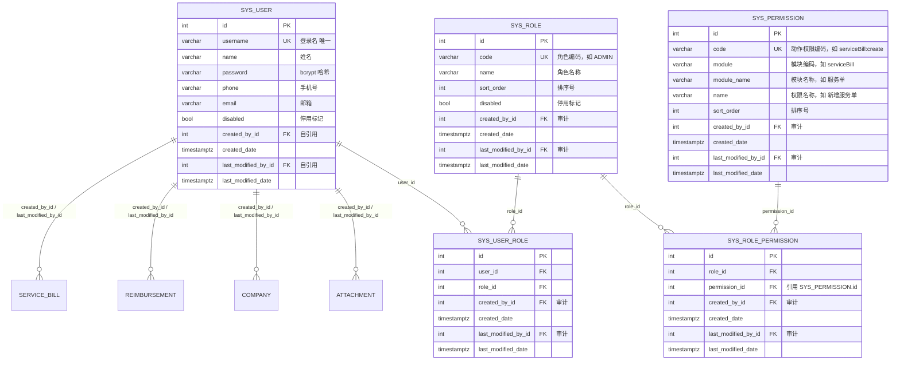

# ER 图

## 业务

```mermaid
erDiagram
    COMPANY ||--o{ SERVICE_BILL : "product_company_id"
    SERVICE_BILL ||--o{ SERVICE_BILL_DETAIL : "service_bill_id"
    SERVICE_BILL ||--o{ SERVICE_BILL_ATTACH_RELATION : "service_bill_id"
    REIMBURSEMENT ||--o{ REIMBURSE_DETAIL : "reimbursement_id"
    REIMBURSEMENT ||--o{ REIMBURSE_ATTACH_RELATION : "reimburse_id"
    ATTACHMENT ||--o{ SERVICE_BILL_ATTACH_RELATION : "attach_id"
    ATTACHMENT ||--o{ REIMBURSE_ATTACH_RELATION : "attach_id"

    COMPANY {
        int id PK
        varchar name "产品公司名称"
        varchar contact_name "联系人"
        varchar contact_phone "联系电话"
        varchar address "地址"
        varchar email "邮箱"
        bool disabled "停用标记"
        int created_by_id FK "审计"
        timestamptz created_date
        int last_modified_by_id FK "审计"
        timestamptz last_modified_date
    }

    SERVICE_BILL {
        int id PK
        varchar number "业务单号"
        smallint type "0=安装 1=维修"
        smallint state "0创建 1处理中 2已处理 3完成"
        numeric total_amount "合计金额"
        varchar project_name "项目名"
        varchar project_address "项目地址"
        varchar project_contact "项目联系人"
        varchar project_contact_phone "项目联系电话"
        varchar elevator_info "电梯信息"
        varchar on_site_contact "现场联系人"
        varchar on_site_phone "现场电话"
        timestamptz order_date "下单日期"
        timestamptz processed_date "处理日期"
        timestamptz finished_date "完成日期"
        varchar remark "备注"
        int product_company_id FK "所属产品公司"
        int version "乐观锁版本号"
        int created_by_id FK "审计"
        timestamptz created_date
        int last_modified_by_id FK "审计"
        timestamptz last_modified_date
    }

    SERVICE_BILL_DETAIL {
        int id PK
        int service_bill_id FK
        varchar device "设备"
        numeric quantity "数量"
        numeric unit_price "单价"
        numeric subtotal "小计"
        varchar remark "备注"
    }

    REIMBURSEMENT {
        int id PK
        varchar number "报销单号"
        smallint state "0创建 1处理中 2完成"
        numeric total_amount "合计金额"
        timestamptz reimburse_date "报销日期"
        varchar summary "摘要"
        varchar remark "备注"
        int version "乐观锁版本号"
        int created_by_id FK "审计"
        timestamptz created_date
        int last_modified_by_id FK "审计"
        timestamptz last_modified_date
    }

    REIMBURSE_DETAIL {
        int id PK
        int reimbursement_id FK
        varchar name "费用项"
        numeric amount "金额"
    }

    ATTACHMENT {
        int id PK
        varchar name "原始文件名"
        varchar relative_path "内部存储键 不对外暴露"
        smallint type "0图片 1PDF 2Word 3Excel 4其他"
        smallint status "0TEMP 1TRANSIENT 2PERSISTENT"
        int created_by_id FK "审计"
        timestamptz created_date
        int last_modified_by_id FK "审计"
        timestamptz last_modified_date
    }

    SERVICE_BILL_ATTACH_RELATION {
        int id PK
        int service_bill_id FK
        int attach_id FK
    }

    REIMBURSE_ATTACH_RELATION {
        int id PK
        int reimburse_id FK
        int attach_id FK
    }
```

## 2. 审计

```mermaid
erDiagram
    SYS_USER ||--o{ SERVICE_BILL : "created_by_id / last_modified_by_id"
    SYS_USER ||--o{ REIMBURSEMENT : "created_by_id / last_modified_by_id"
    SYS_USER ||--o{ COMPANY : "created_by_id / last_modified_by_id"
    SYS_USER ||--o{ ATTACHMENT : "created_by_id / last_modified_by_id"
    SYS_USER ||--o{ SYS_USER_ROLE : "user_id"
    SYS_ROLE ||--o{ SYS_USER_ROLE : "role_id"
    SYS_ROLE ||--o{ SYS_ROLE_PERMISSION : "role_id"
    SYS_PERMISSION ||--o{ SYS_ROLE_PERMISSION : "permission_id"

    SYS_USER {
        int id PK
        varchar username UK "登录名 唯一"
        varchar name "姓名"
        varchar password "bcrypt 哈希"
        varchar phone "手机号"
        varchar email "邮箱"
        bool disabled "停用标记"
        int created_by_id FK "自引用"
        timestamptz created_date
        int last_modified_by_id FK "自引用"
        timestamptz last_modified_date
    }

    SYS_ROLE {
        int id PK
        varchar code UK "角色编码，如 ADMIN"
        varchar name "角色名称"
        int sort_order "排序号"
        bool disabled "停用标记"
        int created_by_id FK "审计"
        timestamptz created_date
        int last_modified_by_id FK "审计"
        timestamptz last_modified_date
    }

    SYS_USER_ROLE {
        int id PK
        int user_id FK
        int role_id FK
        int created_by_id FK "审计"
        timestamptz created_date
        int last_modified_by_id FK "审计"
        timestamptz last_modified_date
    }

    SYS_PERMISSION {
        int id PK
        varchar code UK "动作权限编码，如 serviceBill:create"
        varchar module "模块编码，如 serviceBill"
        varchar module_name "模块名称，如 服务单"
        varchar name "权限名称，如 新增服务单"
        int sort_order "排序号"
        int created_by_id FK "审计"
        timestamptz created_date
        int last_modified_by_id FK "审计"
        timestamptz last_modified_date
    }

    SYS_ROLE_PERMISSION {
        int id PK
        int role_id FK
        int permission_id FK "引用 SYS_PERMISSION.id"
        int created_by_id FK "审计"
        timestamptz created_date
        int last_modified_by_id FK "审计"
        timestamptz last_modified_date
    }
```

